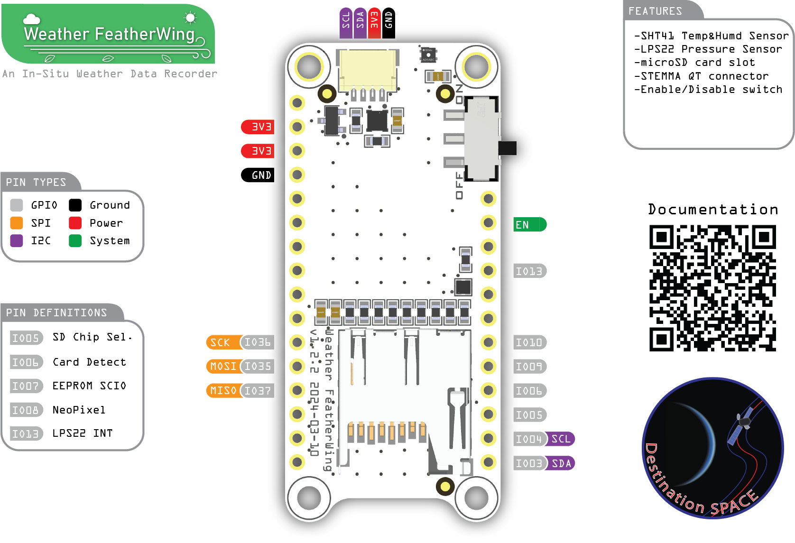

    
    <h1>Destination Weather Station v5.0</h1>
    
An Open Source In-Situ Sensing Platform Compatible with Adafruit Feather and SparkFun Thing platforms

## 🌟 About the Project
Destination Weather Station is the the latest version of remote sensing tools developed to teach students across the southeastern United States about climate science and remote sensing.

## 📝 Specifications
This kit includes all the necessary components to get started with the Destination Weather Station v5.1. The weather station consists of the following

### 🤖 Microcontroller
- Adafruit ESP32-S3 Reverse TFT Feather
### 💾 Storage
- Ejectable microSD card socket
### ⚡ Power
- 2-pin JST-PH connector for 1s Lithium Polymer Ion batteries and charger
- SPDT slide switch
- 50mAh LiPo battery
### 🌡️ Sensors
- Sensiron SHT41 relative humidity and temperature sensor
- STMicroelectronics LPS22 MEMS nano pressure sensor
### 👤 User Interface
- 240x135px color TFT display
- 3x programable buttons
- STEMMA QT expansion sensor connector
## ⚙️ Hardware
All hardware files can be found [here](hardware)
## 💻 Software
All program files can be found [here](software)
## 🗂️ Documentation
Documentation for the weather station can be found [here](docs)

## Licenses
Each of the above sections are individually licensed. Terms and conditions apply within their respective folders.

**Documentation - [Apache License 2.0](docs/LICENSE)**  
**Hardware - [CERN-OHL-P](hardware/LICENSE)**  
**Software - [The MIT License](software/LICENSE)**